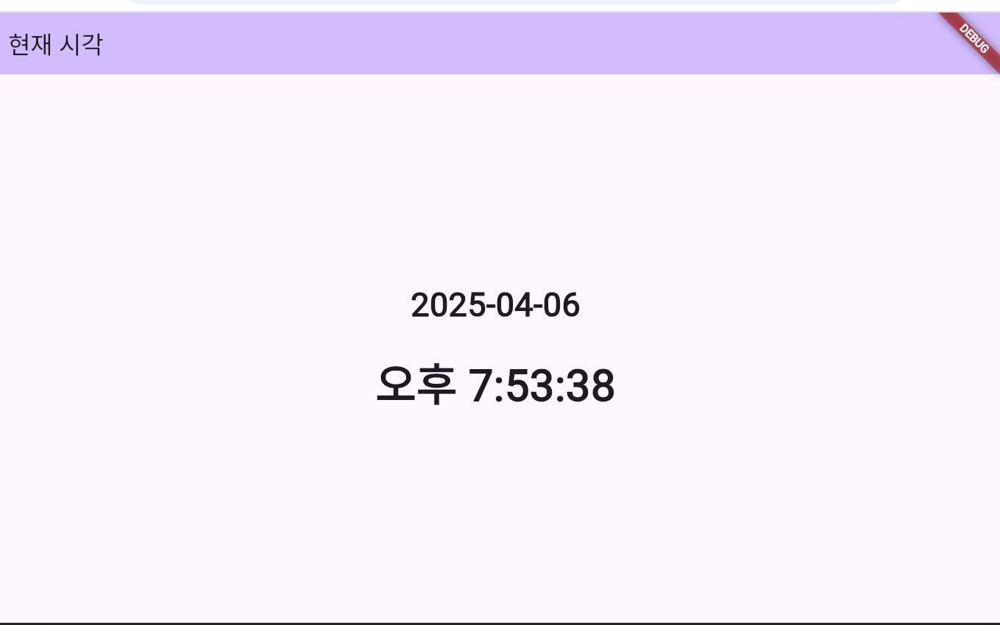

# 현재 시각을 표시하는 앱

---

## 앱 설명

- 상단 AppBar에는 **"현재 시각"** 표시
- 화면 중앙에 현재 날짜 (`yyyy-mm-dd`)와 시간 (`오전/오후 시:분:초`) 출력
- `Timer.periodic()`을 이용해 1초마다 자동 갱신
- 날짜/시간 포맷 커스터마이징 포함

---

## 전체 코드

```dart
import 'package:flutter/material.dart';
import 'dart:async'; 

void main() {
  runApp(const MyApp());
}

class MyApp extends StatelessWidget {
  const MyApp({super.key});

  @override
  Widget build(BuildContext context) {
    return MaterialApp(
      title: 'Flutter Demo',
      theme: ThemeData(
        colorScheme: ColorScheme.fromSeed(seedColor: Colors.deepPurple),
      ),
      home: const TimeApp(),
    );
  }
}

class TimeApp extends StatefulWidget {
  const TimeApp({super.key});

  @override
  State<TimeApp> createState() => _TimeAppState();
}

class _TimeAppState extends State<TimeApp> {
  String dateString = '';
  String timeString = '';

  @override
  void initState() {
    super.initState();
    _updateDateTime();
    Timer.periodic(Duration(seconds: 1), (Timer timer) {
      _updateDateTime();
    });
  }

  void _updateDateTime() {
    final now = DateTime.now();

    setState(() {
      // 날짜 형식: YYYY-MM-DD
      dateString = '${now.year}-${addZero(now.month)}-${addZero(now.day)}';

      // 시간 형식: 오전/오후 H:MM:SS
      String ampm = now.hour < 12 ? '오전' : '오후';
      int hour = now.hour % 12;
      if (hour == 0) hour = 12;

      timeString = '$ampm $hour:${addZero(now.minute)}:${addZero(now.second)}';
    });
  }

  // 숫자가 10보다 작으면 앞에 0 붙이기
  String addZero(int n) {
    if (n < 10) {
      return '0$n';
    }
    return '$n';
  }

  @override
  Widget build(BuildContext context) {
    return Scaffold(
      appBar: AppBar(
        backgroundColor: Theme.of(context).colorScheme.inversePrimary,
        title: Text('현재 시각'),
      ),
      body: Center(
        child: Column(
          mainAxisAlignment: MainAxisAlignment.center,
          children: <Widget>[
            Text(
              dateString,
              style: TextStyle(
                fontSize: 30,
                fontWeight: FontWeight.bold,
              ),
            ),
            SizedBox(height: 20),
            Text(
              timeString,
              style: TextStyle(
                fontSize: 40,
                fontWeight: FontWeight.bold,
              ),
            ),
          ],
        ),
      ),
    );
  }
}
```


## 실행 결과




---
