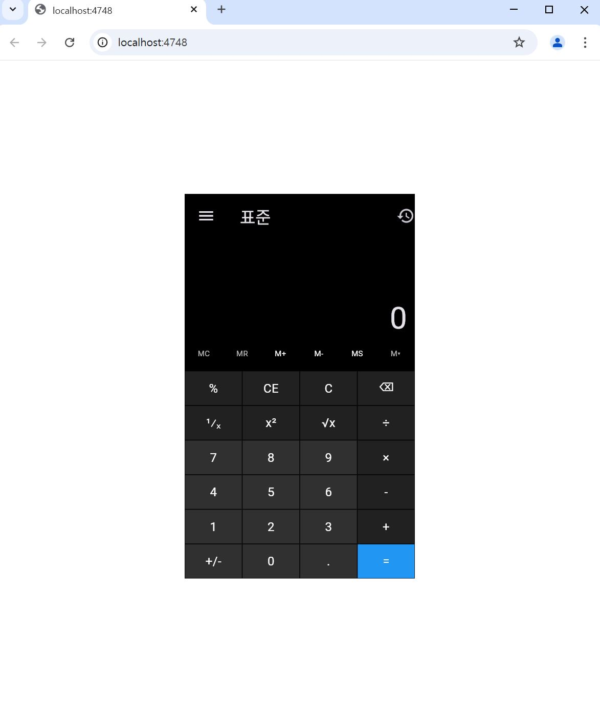

# 계산기 UI (Flutter, Windows 계산기 스타일)

---

## 앱 설명

- Flutter로 만든 계산기 UI
- Windows 계산기 스타일과 유사한 레이아웃
- 숫자, 연산자, 메모리 버튼 포함숫자/연산자/메모리 기능 버튼을 모두 포함

---

## 전체 코드

```dart

// 아래는 실행 화면입니다:

---

## 실행 화면



import 'package:flutter/material.dart';

void main() {
  runApp(const MyApp());
}

class MyApp extends StatelessWidget {
  const MyApp({super.key});

  @override
  Widget build(BuildContext context) {
    return MaterialApp(
      debugShowCheckedModeBanner: false,
      theme: ThemeData(brightness: Brightness.dark),
      home: const Center(
        child: SizedBox(
          width: 300,
          height: 500,
          child: CalculatorUI(),
        ),
      ),
    );
  }
}

class CalculatorUI extends StatelessWidget {
  const CalculatorUI({super.key});

  @override
  Widget build(BuildContext context) {
    return Scaffold(
      backgroundColor: Colors.black,
      appBar: AppBar(
        backgroundColor: Colors.black,
        title: const Text('표준'),
        leading: const Icon(Icons.menu),
        actions: const [Icon(Icons.history)],
      ),
      body: Column(
        children: [
          // 결과 디스플레이
          Expanded(
            child: Align(
              alignment: Alignment.bottomRight,
              child: Padding(
                padding: const EdgeInsets.all(10),
                child: Text(
                  '0',
                  style: TextStyle(fontSize: 40, fontWeight: FontWeight.w300),
                ),
              ),
            ),
          ),

          // 메모리 버튼 행
          Row(
            children:
            ['MC', 'MR', 'M+', 'M-', 'MS', 'M▾'].map((text) =>
                Expanded(
                  child: SizedBox(
                    height: 30,
                    child: Text(
                      text,
                      textAlign: TextAlign.center,
                      style: TextStyle(
                          fontSize: 10,
                          color: ['M+', 'M-', 'MS'].contains(text) ? Colors.white : Colors.white70
                      ),
                    ),
                  ),
                )
            ).toList(),
          ),

          // 버튼 그리드
          buildButtonRow(['%', 'CE', 'C', '⌫']),
          buildButtonRow(['¹⁄ₓ', 'x²', '√x', '÷']),
          buildButtonRow(['7', '8', '9', '×']),
          buildButtonRow(['4', '5', '6', '-']),
          buildButtonRow(['1', '2', '3', '+']),
          buildButtonRow(['+/-', '0', '.', '=']),
        ],
      ),
    );
  }

  Widget buildButtonRow(List<String> buttons) {
    return SizedBox(
      height: 45,
      child: Row(
        children: buttons.map((text) {
          Color backgroundColor;

          if (text == '=') {
            backgroundColor = Colors.blue;
          } else if ('0123456789.'.contains(text) || text == '+/-') {
            backgroundColor = Colors.grey[850]!;
          } else {
            backgroundColor = Colors.grey[900]!;
          }

          return Expanded(
            child: Container(
              margin: const EdgeInsets.all(0.5),
              color: backgroundColor,
              alignment: Alignment.center,
              child: Text(
                text,
                style: const TextStyle(fontSize: 16, color: Colors.white),
              ),
            ),
          );
        }).toList(),
      ),
    );
  }
}

---

[계산기 UI 이미지 보기](App%20Programming/5주차/계산기UI.JPG)

