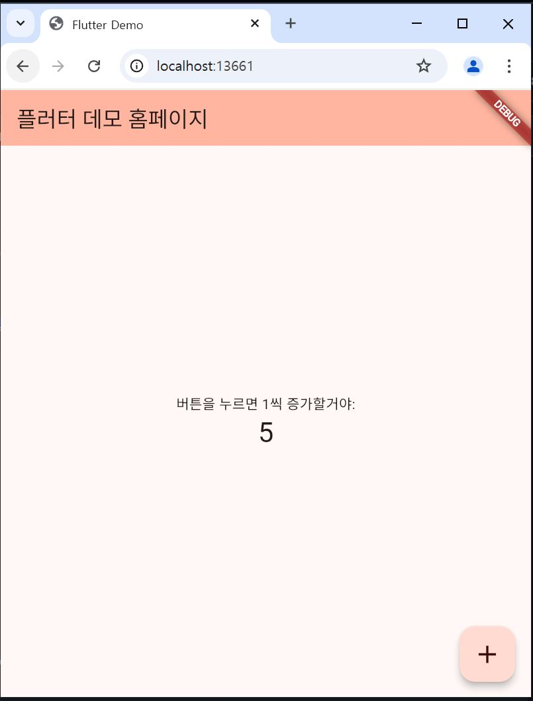
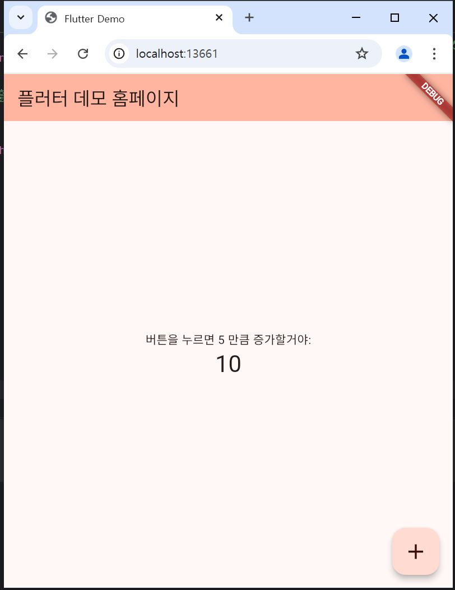
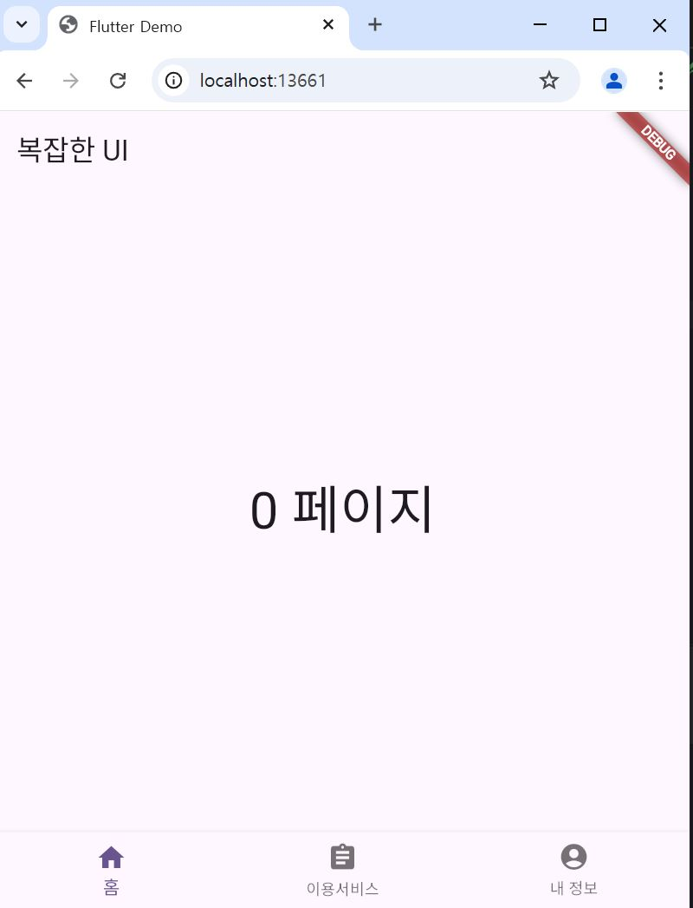
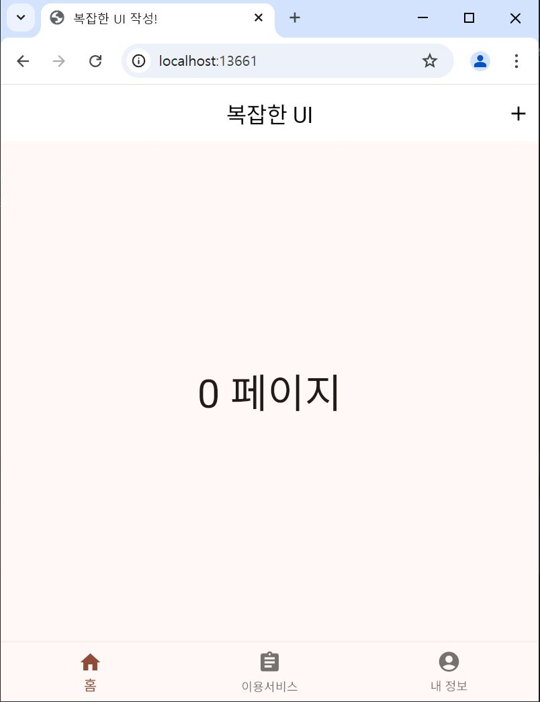

# 7주차 실습모음

---

### 실습 1: 1씩 증가하는 카운터

이 예제에서는 버튼을 누를 때마다 1씩 증가하는 카운터를 구현합니다. 이 코드에서는 _counter 값을 1씩 증가시키는 방식으로 동작합니다.

```dart
import 'package:flutter/material.dart';

void main() {
  runApp(const MyApp());
}

class MyApp extends StatelessWidget {
  const MyApp({super.key});

  @override
  Widget build(BuildContext context) {
    return MaterialApp(
      title: 'Flutter Demo',
      theme: ThemeData(
        colorScheme: ColorScheme.fromSeed(seedColor: Colors.deepOrange),
      ),
      home: const MyHomePage(title: '플러터 데모 홈페이지'),
    );
  }
}

class MyHomePage extends StatefulWidget {
  const MyHomePage({super.key, required this.title});

  final String title;

  @override
  State<MyHomePage> createState() => _MyHomePageState();
}

class _MyHomePageState extends State<MyHomePage> {
  var _counter = 0;

  void _incrementCounter() {
    setState(() {
      _counter++; // 1씩 증가하는 부분
    });
  }

  @override
  Widget build(BuildContext context) {
    return Scaffold(
      appBar: AppBar(
        backgroundColor: Theme.of(context).colorScheme.inversePrimary,
        title: Text(widget.title),
      ),
      body: Center(
        child: Column(
          mainAxisAlignment: MainAxisAlignment.center,
          children: <Widget>[
            const Text('버튼을 누르면 1씩 증가할거야:'),
            Text(
              '$_counter',
              style: Theme.of(context).textTheme.headlineMedium,
            ),
          ],
        ),
      ),
      floatingActionButton: FloatingActionButton(
        onPressed: _incrementCounter,
        tooltip: 'Increment',
        child: const Icon(Icons.add, size: 30),
      ),
    );
  }
}

```

---

### 실습 2: _incSize 만큼 증가하는 카운터

이 예제에서는 카운터가 5씩 증가하도록 설정한 코드로 _incSize를 통해 증가할 값을 설정하고, 버튼 클릭 시마다 그 값만큼 증가하는 방식.

```dart
import 'package:flutter/material.dart';

void main() {
  runApp(const MyApp());
}

class MyApp extends StatelessWidget {
  const MyApp({super.key});

  @override
  Widget build(BuildContext context) {
    return MaterialApp(
      title: 'Flutter Demo',
      theme: ThemeData(
        colorScheme: ColorScheme.fromSeed(seedColor: Colors.deepOrange),
      ),
      home: const MyHomePage(title: '플러터 데모 홈페이지'),
    );
  }
}

class MyHomePage extends StatefulWidget {
  const MyHomePage({super.key, required this.title});

  final String title;

  @override
  State<MyHomePage> createState() => _MyHomePageState();
}

class _MyHomePageState extends State<MyHomePage> {
  var _counter = 0;
  final _incSize = 5; // _incSize 값 설정

  void _incrementCounter() {
    setState(() {
      _counter += _incSize; // _incSize 만큼 증가
    });
  }

  @override
  Widget build(BuildContext context) {
    return Scaffold(
      appBar: AppBar(
        backgroundColor: Theme.of(context).colorScheme.inversePrimary,
        title: Text(widget.title),
      ),
      body: Center(
        child: Column(
          mainAxisAlignment: MainAxisAlignment.center,
          children: <Widget>[
            Text('버튼을 누르면 ${_incSize} 만큼 증가할거야:'), // 수정: ${_incSize}로 변환
            Text(
              '$_counter',
              style: Theme.of(context).textTheme.headlineMedium,
            ),
          ],
        ),
      ),
      floatingActionButton: FloatingActionButton(
        onPressed: _incrementCounter,
        tooltip: 'Increment',
        child: const Icon(Icons.add, size: 30),
      ),
    );
  }
}

```
---

### 실습 3: 복잡한 UI - 하단 네비게이션 바

이 예제에서는 BottomNavigationBar를 사용하여 화면을 전환하는 방법을보여주며, _index를 통해 현재 화면을 관리하고, 하단 네비게이션 바를 클릭할 때마다 화면을 변경한다.

```dart
import 'package:flutter/material.dart';

void main() {
  runApp(const MyApp());
}

class MyApp extends StatelessWidget {
  const MyApp({super.key});

  @override
  Widget build(BuildContext context) {
    return MaterialApp(
      title: 'Flutter Demo',
      theme: ThemeData(
        colorScheme: ColorScheme.fromSeed(seedColor: Colors.deepPurple),
        useMaterial3: true,
      ),
      home: const MyHomePage(),
    );
  }
}

class MyHomePage extends StatefulWidget {
  const MyHomePage({super.key});

  @override
  State<MyHomePage> createState() => _MyHomePageState();
}

class _MyHomePageState extends State<MyHomePage> {
  var _index = 0;

  @override
  Widget build(BuildContext context) {
    return Scaffold(
      appBar: AppBar(
        title: Text('복잡한 UI'),
      ),
      body: Center(
        child: Text(
          '$_index 페이지',
          style: TextStyle(fontSize: 40),
        ),
      ), // Center
      bottomNavigationBar: BottomNavigationBar(
        currentIndex: _index,
        items: [
          BottomNavigationBarItem(label: '홈', icon: Icon(Icons.home)),
          BottomNavigationBarItem(label: '이용서비스', icon: Icon(Icons.assignment)),
          BottomNavigationBarItem(label: '내 정보', icon: Icon(Icons.account_circle)),
        ],
        onTap: (index) {
          setState(() {
            _index = index;
          });
        },
      ), // BottomNavigationBar
    ); // Scaffold
  }
}


```
---

### 실습 4: 하단 네비게이션 바에 debugShowCheckedModeBanner: false 추가

이 예제는 debugShowCheckedModeBanner: false를 설정하여 디버그 배너를 숨김. 하단 네비게이션 바를 이용하여 화면을 전환하고, 앱을 좀 더 깔끔하게 설정한다.

```dart
import 'package:flutter/material.dart';

void main() {
  runApp(const MyApp());
}

class MyApp extends StatelessWidget {
  const MyApp({super.key});

  @override
  Widget build(BuildContext context) {
    return MaterialApp(
      title: '복잡한 UI 작성!',
      theme: ThemeData(
        colorScheme: ColorScheme.fromSeed(seedColor: Colors.deepOrange),
      ),
      home: const MyHomePage(),
      debugShowCheckedModeBanner: false,
    );
  }
}

class MyHomePage extends StatefulWidget {
  const MyHomePage({super.key});

  @override
  State<MyHomePage> createState() => _MyHomePageState();
}

class _MyHomePageState extends State<MyHomePage> {
  var _index = 0;

  @override
  Widget build(BuildContext context) {
    return Scaffold(
      appBar: AppBar(
        backgroundColor: Colors.white,
        title: Text('복잡한 UI', style: TextStyle(color: Colors.black)),
        centerTitle: true,
        actions: [
          IconButton(
            icon: Icon(Icons.add, color: Colors.black),
            onPressed: () {},
          ),
        ],
      ),
      body: Center(
        child: Text(
          '$_index 페이지',
          style: TextStyle(fontSize: 40),
        ),
      ),
      bottomNavigationBar: BottomNavigationBar(
        currentIndex: _index,
        items: [
          BottomNavigationBarItem(label: '홈', icon: Icon(Icons.home)),
          BottomNavigationBarItem(label: '이용서비스', icon: Icon(Icons.assignment)),
          BottomNavigationBarItem(label: '내 정보', icon: Icon(Icons.account_circle)),
        ],
        onTap: (index) {
          setState(() {
            _index = index;
          });
        },
      ),
    );
  }
}

```
---

## 실행 결과






---


